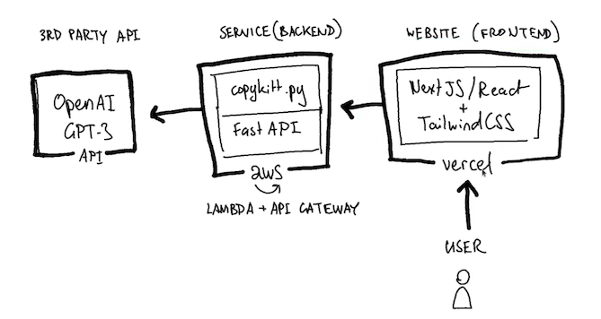

<h1 align="center">AI BRANDING</h1>

Your automated AI branding assistant

  
  
  
  
  

  <h2 align="center">Frontend Techstack</h2>
  <table>
   <tr>
    <th>Type</th>
    <th>Technology</th>
    <th>Version</th>
    <th>Description</th>
   </tr>
   <tr>
    <td><b>Language</b></td>
    <td>

</td>
    <td>5.3</td>
    <td><b>Typescript:</b> superset of JavaScript that adds optional types and other features.</td>
   </tr>
   <tr>
    <td><b>Frameworks</b></td>
    <td>
 
</td>
    <td>18, 14</td>
    <td><b>ReactJS 18:</b> used to build user interfaces with components.   <b>NextJS 14:</b> used to build React applications with server-side rendering and other features.</td>
   </tr>
    <tr>
      <td><b>Styling</b></td>
      <td>

</td>
      <td>3</td>
      <td><b>Tailwind CSS:</b> utility-first CSS framework for rapidly building custom user interfaces.</td>
    </tr>
    <tr>
      <td><b>Hosting</b></td>
      <td>

</td>
      <td>23</td>
      <td><b>Vercel:</b> platform for deploying and scaling frontend web applications and serverless functions.</td>
    </tr>
 </table>

  <h2 align="center">Backend Techstack</h2>
  <table>
   <tr>
    <th>Type</th>
    <th>Technology</th>
    <th>Version</th>
    <th>Description</th>
   </tr>
   <tr>
    <td><b>Language</b></td>
    <td>

</td>
    <td>3.11</td>
    <td><b>Python:</b> high-level, interpreted, and general-purpose programming language.</td>
   </tr>
   <tr>
    <td><b>Framework</b></td>
    <td>

</td>
    <td>0.109</td>
    <td><b>FastAPI:</b> web framework for building APIs with Python 3.8+ based on standard Python type hints.</td>
   </tr>
    <tr>
      <td><b>Hosting</b></td>
      <td>
 
</td>
      <td>3.12</td>
      <td><b>AWS API Gateway:</b> service for creating, publishing, maintaining, monitoring, and securing APIs at any scale. <b>AWS Lambda:</b> service for running code without provisioning or managing servers.</td>
    </tr>
    <tr>
      <td><b>Others</b></td>
      <td>
 
</td>
      <td>1.9, 20</td>
      <td><b>OpenAI:</b> Python library for accessing the OpenAI REST API.  <b>Docker:</b> platform for building, running, and sharing containerized applications.</td>
    </tr>
 </table>

<h2 align="left">Architecture with Serverless Hosting</h2>

